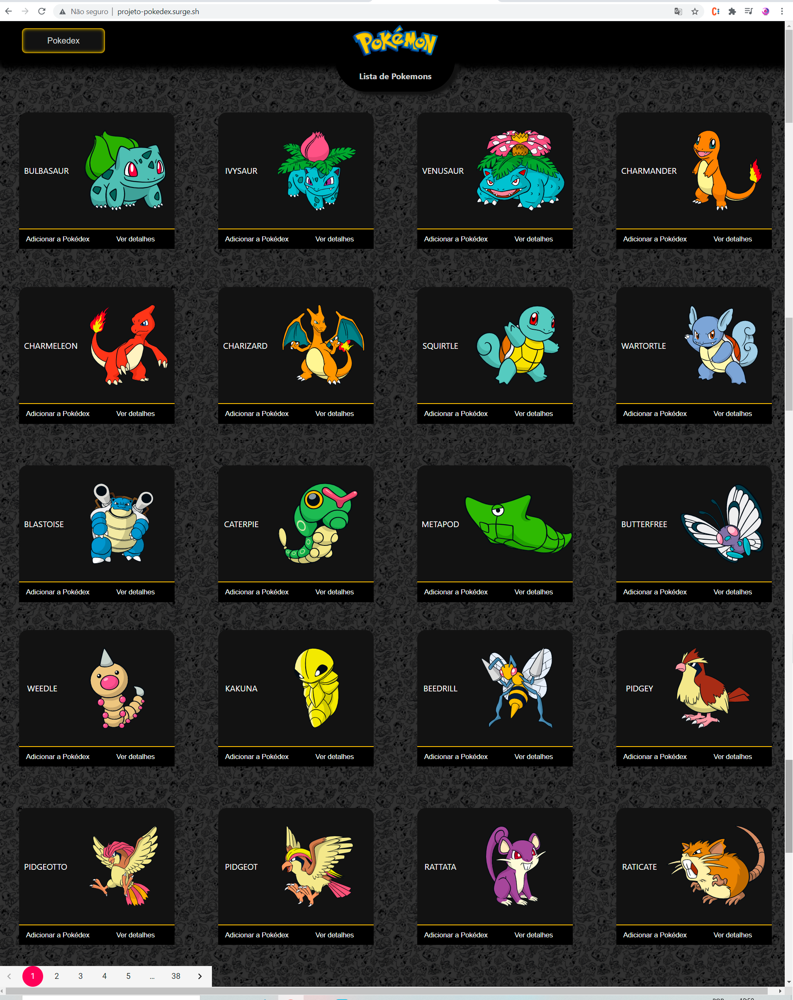
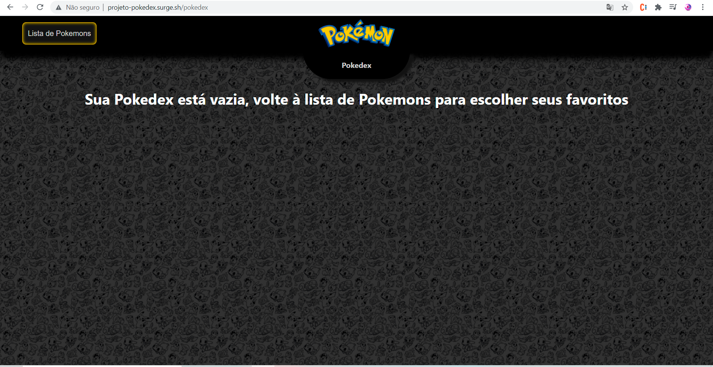
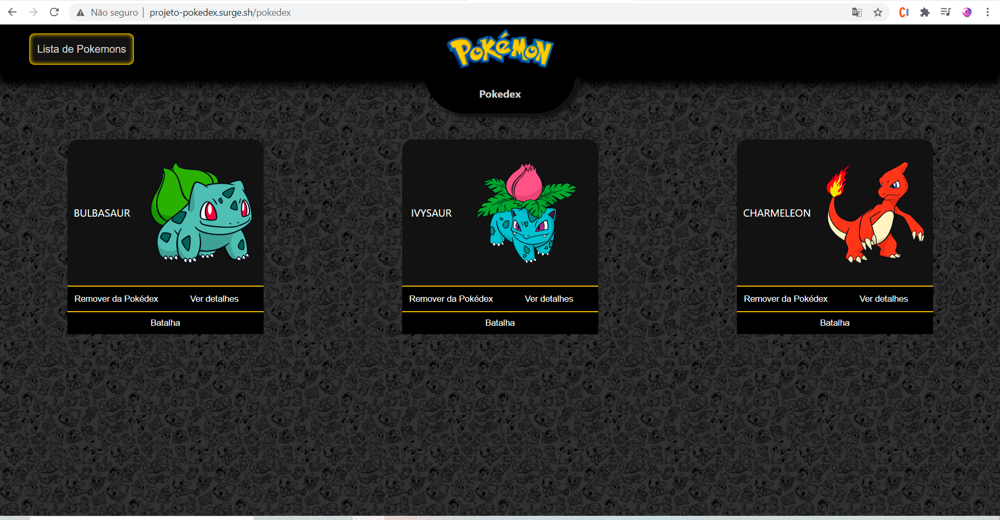
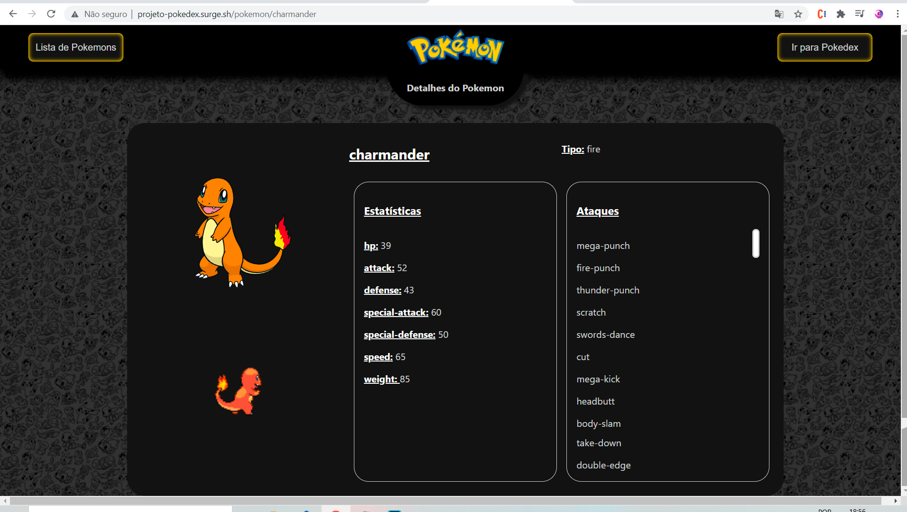
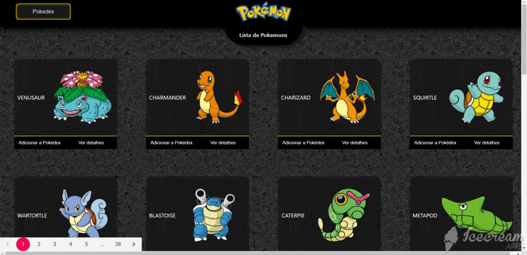

<h2 align="center">POKEDEX</h2>

<hr/>

## ⚙️ Desenvolvido por: 
- [Clara Meirelles](https://github.com/ClaraMeirelles)
- [Juliana Moraes](https://github.com/jhmoraes)
- [Gremis Tovar](https://github.com/Gremis)

Link do Surge: https://projeto-pokedex.surge.sh/

## ⚙️ O que funciona:
- Permite visualizar os Pokémons da [PokeAPI](https://pokeapi.co/)
- Paginação feita com 29 pokémons por página
- Permite ao usuário que adicione e remova pokémons da sua pokédex
- Batalhas com pokémons adicionados à sua pokédex (adversário escolhido aleatóriamente)
- Ataques e defesas do pokémon e do adversário medidos pelos dados fornecidos pelo stat de cada um
## ⚙️ O que não funciona
- Ataque aleatório do rival é sempre selecionado o mesmo (random não funcionou)

## ⚙️ Tecnologias Usadas:
- CSS3
- JavaScript
- React Js
- Styled Components
- Axios
- Sweetalert2

## Instalação

## 🏁 Para rodar o projeto:

Clone este repositório em sua máquina:

```bash
$ git clone https://github.com/future4code/munoz-pokedex2.git
```

cd `munoz-pokedex2` e rode:

```bash
npm install
```

para iniciar:

```bash
npm run start
```

<br/>

## Finalmente

O funcionamento e o layout deste aplicativo pode ser visto nas seguintes imagens:

Tela de Inicio



Tela de Pokedex Vazia



Tela de Pokedex com Pokemons



Tela de detalhes



Funcionamento Geral



Funcionamento da Batalhas Pokemon


